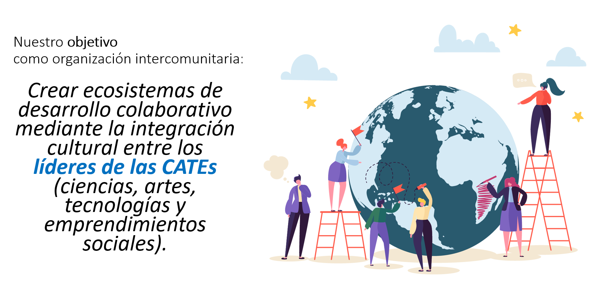
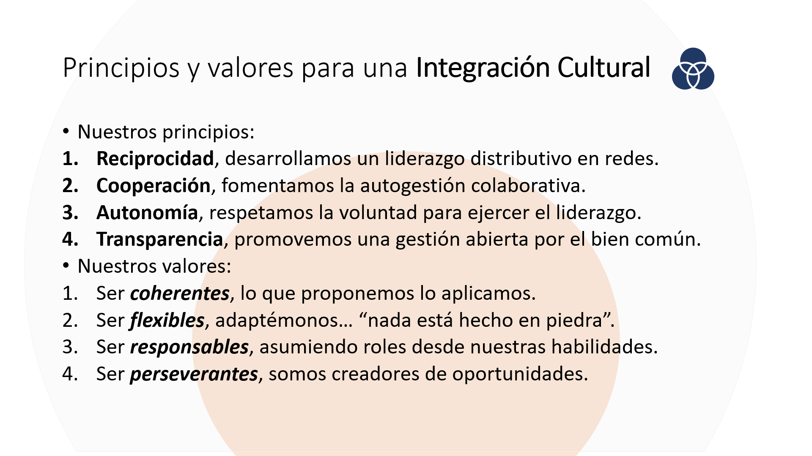
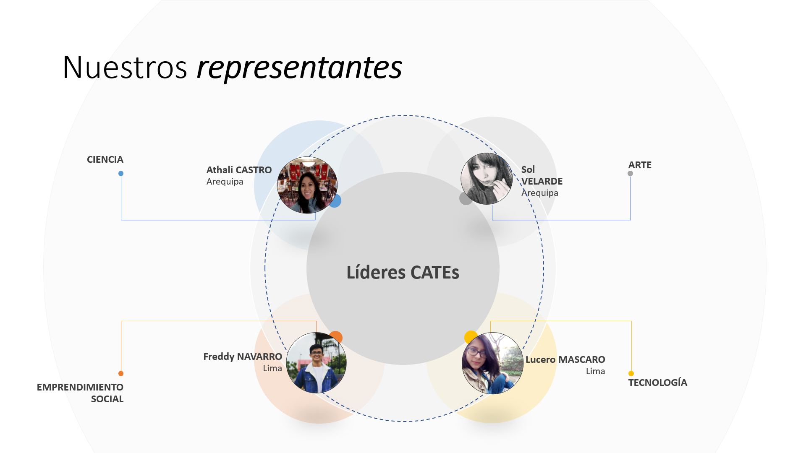
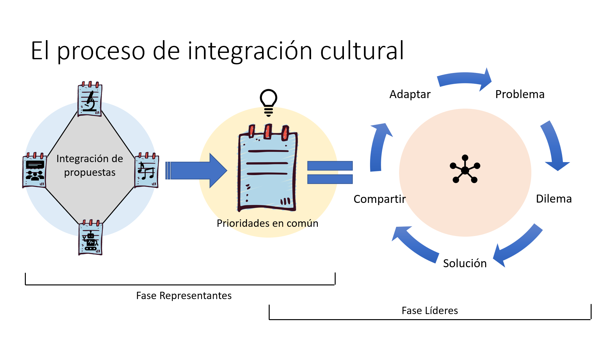

# La Red FestiLab, manifiesto.
## Declaración Abierta sobre una Alianza Pública para la Integración Cultural, hacia una cultura organizacional orientada a las CATEs.

> Intervención Comunitaria: 
“Procesos intencionales de cambio, mediante mecanismos participativos tendientes al desarrollo de recursos de la población, el desarrollo de organizaciones comunitarias autónomas, a la modificación de las representaciones de su rol en la sociedad y sobre el valor de sus propias acciones para ser activo en las condiciones que las marginan y excluyen.”. 
Lapalma (2001), sobre el Liderazgo Comunitario.

## Presentación

Desde cuatro años venimos impulsando el desarrollo de un modelo de organización social basado en la [integración cultural](https://medium.com/@davidchaupismeza/manifesto-para-la-integraci%C3%B3n-cultural-5cd46ec3a826), co-creando con jóvenes líderes el desarrollo de un mecanismo participativo para la intervención ciudadana. De esta manera organizamos anualmente los **#FestiLabs**, una iniciativa de innovación social, cuyo objetivo es la creación de ecosistemas de desarrollo colaborativo integrando las CATEs (ciencias, artes, tecnologías y emprendimientos sociales).

Como movimiento social somos conscientes que esta labor integrativa es un trabajo de a largo plazo, dirigiendo los esfuerzos hacia una política pública como modelo societario, así incidir en la ciudadanía basado en el desarrollo de una cultura organizacional orientada a la integración de las CATEs.

## Estructura organizacional 

Para lograr tal integración cultural nos valemos de una estructura organizacional, la misma que se ha construido de una manera orgánica, es decir, con la contribución progresiva de cada uno de los miembros que han sumado al crecimiento de esta red de comunidades locales. En ese sentido, reconocemos dos niveles de organización tanto interno (nuclear): voluntarios, coordinadoras, líderes activos y representantes, así como también externo (celular): líderes emergentes, sociedad, gobierno local y aliados. 

Diversos son los factores que originan el desarrollo de una cultura, siendo en especial los principios y valores que guían la visión como sociedad, siendo así nuestra organización intercomunitaria promueve cuatro principios y valores que fundamentan el modelo de organización social basada en la integración cultural (Fig. 2). 

## Tipos de Alianza 

En ese sentido, la Red FestiLab lo invita a formar parte del proceso de integración cultural llevado a cabo este año: #FestiLab2020. Queremos compartir con ustedes la oportunidad de ser parte del desarrollo colaborativo en las Américas, queremos que se sumen a la autogestión colaborativa producto del esfuerzo de múltiples inteligencias colectivas, queremos co-crear una red de ecosistemas autosostenibles (“microestados hiperconectados”).

Para lograr tal sostenibilidad es importante la articulación entre aliados estratégicos, los cuales aporten en diversos grados de capacidad de gestión. Es así que La Red FestiLab presenta tres tipos de alianza que declaran el nivel de colaboración que, toda entidad o institución, le permita aportar públicamente a los fines de nuestra organización.

Tipos de alianza
1.	Organizativa: todo apoyo en la etapa de planeación, todo aporte destinado al desarrollo creativo de las actividades de la organización (ej.: Participación directa en el desarrollo de un #FestiLab en tu ciudad).
2.	Productiva: todo apoyo en la etapa de ejecución, ya sea a través de patrocinios o auspicios destinados a las actividades de la organización (ej.: Donación de recursos materiales, respaldo de equipo técnico, colaboración logística, etc.).
3.	Formativa: todo apoyo en la etapa de formación, ya sea a titulo personal o institucional destinados a los voluntarios de la organización (ej. Talleres, Webinars, espacios para intervenciones comunitarias, etc.).

## Mecanismo de intervención comunitaria 

Finalmente, La Red FestiLab hace un llamado a todas aquellas entidades e instituciones que desean formar parte de nuestra iniciativa a colaborar abiertamente, por una integración de esfuerzos comunitarios que impulsa a la cohesión social. Súmate a nuestro proceso de integración cultural que este año empieza con el Foro CATEs (del 23 al 27 de junio) y se consolidad en el evento anual con el #FestiLab2020 (del 27 al 29 de noviembre). 

Todos organizamos el FestiLab, súmate tú también a la red de redes.

## Enlaces de interés  

--- 
> ¿Deseas suscribirte a nuestra alianza por la integración cultural? 
Contáctanos: red.festilab@gmail.com

# ¡BIENVENIDOS SEAN TODOS A LA DISRUPCIÓN!
